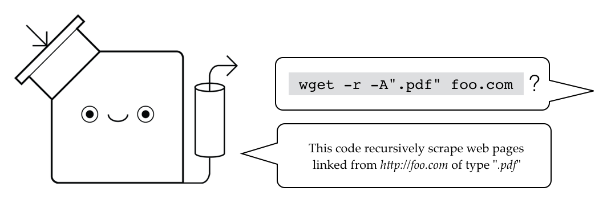

# Tutorons Server

The Tutorons server explains code found in HTML web pages.
The current server detects and explains CSS selectors, the `wget` command line, regular expressions, and Python built-in functions.
For a demo, see the [Tutorons site](http://www.tutorons.com).

This code serves as a starting point for writing code detectors and explainers of your own.

## Getting started

Install all Python dependencies:

    pip install -r launch/roles/webserver/files/tutorons-reqs.txt

The fetch precompiled dependencies:

    pip install awscli
    cd deps/ && ./fetch_deps.sh

### Compiling C dependencies

Tutorons uses parsers written in multiple languages to produce structures to be explained.
The Python code therefore interfaces with both C code and Java.
To work with all example Tutorons, you will need to do follow these steps.

Fetch the C source submodules:

    git submodule init && git submodule update

This guide lacks instructions for Windows and Linux, though setup should be about the same.
It has been tested on Ubuntu---see the `launch/roles/webserver/templats/compile-*.j2` files.
Feel free to give it a try and send me a message if it doesn't work.

#### OS X setup

You may need to upgrade/install xcode command line tools for building the C code:
    
    xcode-select --install

Download the following dependencies via Homebrew:

    brew install gettext md5sha1sum

Then update your system paths to include point to the right build tools:

    export PATH=$PATH:/usr/local/opt/gettext/bin
    export AC_LOCAL_PATH=$AC_LOCAL_PATH:/usr/local/share/aclocal/

#### Compiling the sources

To compile `wget` (used for the wget Tutoron):

    cd deps/wget
    ./bootstrap
    ./configure --with-ssl=openssl
    make

To compile `sed` and `grep` (used for the regular expression Tutoron):

    # Build sed
    cd deps/sed
    ./bootstrap
    ./configure
    make

    # Build grep
    cd ../deps/grep
    ./bootstrap
    ./configure
    WERROR_CFLAGS= make -e

## Run the Server

Use these commands to launch the server:

    source venv/bin/activate  # start the virtual environment
    ./rundevserver

You can verify that the server is running by visiting http://127.0.0.1:8002 in your browser.

As a note, the `rundevserver` script does several tasks:
* Appends all Java dependencies to the Java CLASSPATH variable
* Launches internal and third-party servers for computing explanations
* Kicks off the Django server with a typical `python manage.py runserver` command on localhost port 8002

## Contributing

### Developer workflow

1. Create a new branch for doing your work: `git checkout -b <branchname>`
2. Do your local work and commit.  All new features or bug fixes should be accompanied by tests.
3. Run the test suite to make sure everything still passes
4. Push your branch
4. Submit a pull request to merge into master ([see here](https://help.github.com/articles/using-pull-requests/)).  Assign the pull request to someone else on the team who should verify the style and design choices of your code.
6. Respond to any comments you get from reviewers
7. Once your pull request is accepted, merge your pull request into master
8. Check out the master branch and verify that all tests still pass

### Developing with a virtual environment

When installing dependencies, install them to a virtual environment instead of your global Python library.
Here's how you can do this.

    pip install virtualenv
    virtualenv venv           # create a new virtual environment at folder "venv"
    source venv/bin/activate  # start the virtual environment
    pip install -r launch/roles/webserver/files/tutorons-reqs.txt  # install dependencies to the virtual environment

All pull requests should include an up-to-date version of the requirements.
If you installed anything new, make sure to include a new requirements file in your commit:

    pip freeze > launch/roles/webserver/files/tutorons-reqs.txt

### Run the unit tests

Before you commit, you need to make sure all existing tests are still running.
The easiest way is to do the following from the main directory:

    # Run these two commands in one Terminal tab
    source venv/bin/activate
    ./rundevserver

    # Run the next two commands in a second Terminal tab
    source venv/bin/activate
    DJANGO_SETTINGS_MODULE=tutorons.settings.dev python manage.py test --failfast

The `rundevserver` script should be running when you invoke the tests.
This connects Python to Java JARs that will be invoked in the CSS unit tests.
